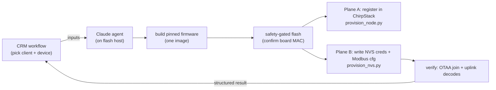

# CRM Developer Guide — driving a Claude agent to build & flash node firmware

> **⚠️ Read [`CRM_PROVISIONING_WORKFLOW.md`](CRM_PROVISIONING_WORKFLOW.md) first — it is the source
> of truth for the current factory→field order of operations** (DevEUI-from-MAC, scan-before-join,
> compiled-per-build profile, QR-triggered ChirpStack registration). This guide's **agent
> mechanics** (prompt, inputs, hardware-safety gates, structured result, failure handling) still
> apply, but where the *sequence* here differs from the workflow doc, the workflow doc wins.
>
> **Audience:** the `crm.siot.solutions` developer.
> **Goal:** how to instruct a Claude Code agent, from the CRM provisioning workflow, to **build →
> safety-gated flash → provision → verify** a `rak3112-rs485-node` using this repo — with no
> hand-holding and no secrets leakage.
> **Status:** rev1 · 2026-06-24 · pairs with [`docs/PROVISIONING_API_CONTRACT.md`](PROVISIONING_API_CONTRACT.md)
> and [`device-profiles/`](../device-profiles/README.md).

---

## 0. Mental model (read this first — it changes the workflow)

**You do NOT regenerate firmware per device.** Build **one** pinned firmware image; differentiate
each unit by **data** (device profile + LoRaWAN credentials) provisioned at flash time. This is the
recommended method: one image to build/test/OTA/certify, and a new device or client site = new
**data**, not a new build.



- **Device selection** = NVS `prov-modbus <dev> …` at provisioning time (both MFM384 and RS-FSJT are
  compiled into the one image; the field loop branches on the NVS value at runtime).
- **Slave/unit ID** = provisioned today (NVS `unit`); auto-discovery via bus-scan is the roadmap
  (see §11). The device profile deliberately omits the unit ID.
- The agent runs **on a host physically connected to the board** (a flashing station), because it
  flashes over USB and verifies the boot log.

---

## 1. The moving parts

| Piece | Where | Role |
|---|---|---|
| Firmware repo | this repo, pinned tag `phase-6-modbus-green` (or later prod tag) | the one image |
| Device profiles | [`device-profiles/profiles/*.json`](../device-profiles/README.md) | bus + register map + payload (per device, **no unit ID**) |
| Plane A driver | `tools/provision_node.py` | registers DevEUI/AppKey into ChirpStack via the SCOMM CRM |
| Plane B driver | `tools/provision_nvs.py` | writes creds + Modbus cfg into node NVS over the USB console |
| Value template | `tools/provision_template.json` | declarative source-of-values (secrets are `${ENV:…}`) |
| Provisioning contract | `docs/PROVISIONING_API_CONTRACT.md` | the authoritative API/values contract |
| ChirpStack decoder | `tools/chirpstack_mfm384_decoder.js` | decodes uplinks (device `0x01` MFM384, `0x02` RS-FSJT) |

---

## 2. Inputs the CRM must hand the agent

The CRM resolves these (most are already in the provisioning workflow) and passes them to the agent.
**Secrets go through `firmware/.env` or environment — never inline in the prompt or any commit.**

| Input | Source in CRM | Example | Secret |
|---|---|---|---|
| `DEVICE_PROFILE` | selected device model | `selec-mfm384` | no |
| `LORAWAN_DEVEUI` / `LORAWAN_JOINEUI` | minted / config | `3cdc75fffe6f85dc` / `0000000000000000` | no |
| `LORAWAN_APPKEY` | minted (CRM) | *(32 hex)* | **yes** |
| `LORAWAN_REGION` | constant | `AS923-1` | no |
| `TARGET_PORT` | flashing station | `/dev/cu.usbmodem1401` | no |
| `EXPECTED_BOARD_MAC` | device record (serial ↔ MAC) | `3c:dc:75:6f:85:dc` | no |
| `MODBUS_*` (`DEVICE/BAUD/PARITY/SLAVE_ID`) | from the device profile (`SLAVE_ID` per site) | `mfm384 / 9600 / N / 1` | no |
| `SAMPLE_INTERVAL_S` | site policy | `60` | no |
| client/site metadata | task record | … | no |

> The agent **reads bus params (baud/parity/FC/word-order) from the profile**, not from free text —
> the profile is the source of truth. The CRM only needs to name the profile (+ the per-site unit ID
> until auto-scan lands).

---

## 3. Prerequisites on the flash host (one-time)

- macOS/Linux flashing station with the board on USB.
- ESP-IDF **v5.5.4** installed; the agent sources it (`. ~/esp/esp-idf-v5.5.4/export.sh`).
- This repo cloned; `gh` authenticated for the org; `pyserial` (ships in the ESP-IDF env).
- `firmware/.env` populated from the CRM values (gitignored) — or the agent writes it (see template).
- CRM credentials for Plane A in `~/.config/siot/rak3112-crm.env` (0600), per the contract doc.

---

## 4. The agent prompt (copy-paste, fill the `<…>`)

This is what the CRM developer feeds their Claude agent. Keep it verbatim; only fill the inputs.

```text
You are provisioning ONE Southern IoT RS-485→LoRaWAN node (rak3112-rs485-node) from the CRM
workflow. Work in the repo at <REPO_PATH>. Be hardware-safe and never print or commit secrets.

INPUTS (from CRM):
  DEVICE_PROFILE     = <selec-mfm384 | honeywell-eem400 | deepsea-dse>
  TARGET_PORT        = <serial port, e.g. /dev/cu.usbmodem1401>
  EXPECTED_BOARD_MAC = <aa:bb:cc:dd:ee:ff>          # device record; flash ONLY this board
  SAMPLE_INTERVAL_S  = <e.g. 60>
  Credentials + Modbus config are in firmware/.env (DevEUI/JoinEUI/AppKey, MODBUS_*). Do not echo AppKey.

STEPS (stop and report on any failure; do not improvise around a failed gate):
  1. git fetch && git checkout phase-6-modbus-green   # the pinned green firmware
  2. Confirm DEVICE_PROFILE is supported by the firmware build (device-profiles/ has the profile AND
     firmware/components/meter implements meter_read_<dev>). If not (e.g. EEM400/DSE today), STOP and
     report "profile not yet flashable — needs reader integration" — do NOT guess a register map.
  3. Read device-profiles/profiles/<DEVICE_PROFILE>.json → take bus baud/parity + the MODBUS device id.
  4. . ~/esp/esp-idf-v5.5.4/export.sh ; cd firmware ; idf.py set-target esp32s3 ; idf.py build
  5. HARDWARE SAFETY GATE — before any flash:
       python -m esptool --chip esp32s3 -p TARGET_PORT chip_id   # read MAC
       If MAC != EXPECTED_BOARD_MAC → ABORT and report. Never flash an unexpected board.
       Never run erase_flash.
  6. idf.py -p TARGET_PORT flash
  7. PLANE A (network): python3 ../tools/provision_node.py        # register DevEUI/AppKey in ChirpStack
  8. PLANE B (device):  python3 ../tools/provision_nvs.py -p TARGET_PORT   # NVS creds + Modbus cfg
  9. VERIFY: read the boot log → expect "OTAA: DevEUI=… [creds:NVS]" then "uplink OK"; then confirm
     in ChirpStack (10.10.8.140) the uplink decodes via tools/chirpstack_<dev>_decoder.js to sane
     values (e.g. ~230 V / ~50 Hz, simulated:false).
  10. REPORT a JSON result (see guide §9) back to me. Re-flash the default image is NOT needed.

GUARDRAILS:
  - Confirm board MAC before flashing (step 5). No erase. No secrets in tree/logs.
  - If the profile's MODBUS read times out at the field unit ID, the slave ID likely differs at this
    site — run the bench scan mode (sdkconfig.defaults.scan) to discover it, update MODBUS_SLAVE_ID,
    re-provision Plane B (no rebuild), and retry. Do not change firmware code.
```

---

## 5. What each step proves (gate checks)

| Step | PASS evidence |
|---|---|
| build | `Project build complete`, `build/rak3112_rs485_node.bin` produced |
| safety gate | `esptool chip_id` MAC **equals** `EXPECTED_BOARD_MAC` |
| flash | `Hash of data verified` for each region; `Hard resetting` |
| Plane A | CRM task → `lorawanProvisioningStatus = COMPLETED`; `GET /chirpstack/device/<deveui>` found |
| Plane B | console `prov-show` reflects the creds + Modbus cfg; node restarts into field mode |
| verify | boot log `[creds:NVS]` + `uplink OK`; ChirpStack frame decodes to sane values |

---

## 6. Hardware-safety gates (mandatory — from this repo's CLAUDE.md)

1. **Confirm board identity before every flash.** `esptool chip_id` MAC must equal the CRM device
   record's MAC. A flashing station may have several boards on USB — flashing the wrong one is the
   top risk. The agent **aborts** on mismatch.
2. **No `erase_flash`.** A full erase wipes the LoRaWAN nonces/session and the `prov` NVS → forces a
   re-join and re-provision. Provisioning is **additive** (Plane B preserves nonces); never erase.
3. **One board per run.** The agent provisions exactly the board named by `EXPECTED_BOARD_MAC`.
4. **Native-USB port only.** The RAK3112 console/flash is the USB-Serial-JTAG port; auto-detect it,
   don't hardcode (it re-enumerates across replugs).

---

## 7. Secrets & guardrails

- DevEUI/JoinEUI/AppKey + Modbus config live in `firmware/.env` (gitignored) or `${ENV:…}` per
  `tools/provision_template.json`. The **AppKey is never printed** (the tools redact it) and never
  committed. `gitleaks` runs in pre-commit + CI as a backstop.
- The agent must not commit `.env`, `lora_credentials.h`, or any minted value. The committed
  `lora_credentials.h.example` (all-zero placeholder) is the only credential file in the tree.
- The agent changes **no firmware source** during provisioning — it only builds, flashes, and writes
  NVS data. Code changes are a separate, reviewed PR.

---

## 8. Verification — end to end

The node logs `field app: REAL Modbus … [cfg:NVS]`, joins (`[creds:NVS]` → `session restored` or a
fresh join), then `uplink OK` every interval. Confirm the **decode** in ChirpStack: paste the
device's decoder (`tools/chirpstack_<dev>_decoder.js`) into the device-profile Codec tab and check
the frame renders sane engineering values with `simulated:false`, `stale:false`. (Worked example:
RS-FSJT fCnt 434, payload `0102000028` → `wind_mps 0.40`; see `docs/RUNBOOK.md` Phase 6c.)

---

## 9. Structured result the agent returns to the CRM

The agent ends with a machine-parseable block the CRM can ingest:

```json
{
  "status": "success",
  "device_profile": "selec-mfm384",
  "board_mac": "3c:dc:75:6f:85:dc",
  "firmware_tag": "phase-6-modbus-green",
  "binary_sha256": "661367b2…",
  "plane_a_chirpstack": "registered",
  "plane_b_nvs": "written",
  "join": "ok",
  "first_uplink_fcnt": 434,
  "decoded_ok": true
}
```
On failure: `{"status":"failed","stage":"<build|safety|flash|planeA|planeB|verify>","reason":"…"}`.

---

## 10. Failure handling / rollback

| Stage fails | Action |
|---|---|
| build | report compiler error; do not flash |
| safety gate (MAC mismatch) | **abort**, report — never flash |
| flash | retry once on a transient USB error; else report (check cable/port/BOOT) |
| Plane A | report CRM/ChirpStack error; the device can still be NVS-provisioned and will join once registered |
| Plane B | re-run `provision_nvs.py`; it's additive and idempotent (nonces preserved) |
| verify (no uplink) | if Modbus read times out → slave-ID/wiring (see §4 guardrail, run scan); if join fails → check creds match Plane A + antenna/region |

Rollback is "re-provision data" (Plane B is additive, no erase). There is no destructive step in the
happy path.

---

## 11. Device support matrix + roadmap

| Profile | Profile in repo | Reader in firmware | Flashable today |
|---|---|---|---|
| `selec-mfm384` | ✅ | ✅ | **yes** |
| RS-FSJT-N01 (wind) | (firmware) | ✅ | **yes** |
| `honeywell-eem400` | ✅ | ❌ (reference only) | no — needs reader integration |
| `deepsea-dse` | ✅ | ❌ (reference only) | no — needs reader integration |

**To make EEM400 / DSE flashable** (a reviewed firmware PR, not an agent provisioning step): port the
proven readers from `device-profiles/reference/firmware/components/meter/meter_<dev>.c` into
`firmware/components/meter/`, add the payload encoder + a device byte, extend the Kconfig device
choice, and host-test. Bump the device byte to the unified registry (`MFM384=0x01, RS-FSJT=0x02,
EEM400=0x03, DSE=0x04`).

**Roadmap (the "generate on the go" end-state — Phase 7d+):** a generic, *profile-driven* Modbus
reader that consumes the full register map from NVS/CRM at runtime + **auto-scan for the slave ID** at
commissioning. Then ANY device with a profile is flashable with zero firmware change, and this guide's
step 2 "is the reader implemented?" check disappears. Until then, the agent only flashes devices whose
reader is compiled in (the matrix above).

---

## 12. References
- `docs/PROVISIONING_API_CONTRACT.md` — the authoritative provisioning value/API contract (2 planes).
- `device-profiles/README.md` — profile schema, unified device-byte registry, ground-truth rule.
- `tools/provision_template.json` — declarative source-of-values (secrets via `${ENV:…}`).
- `docs/RUNBOOK.md` (Phase 6c) — worked end-to-end bench evidence.
- `CLAUDE.md` §3 guardrails + §6 hardware-safety — the hard rules the agent inherits.
