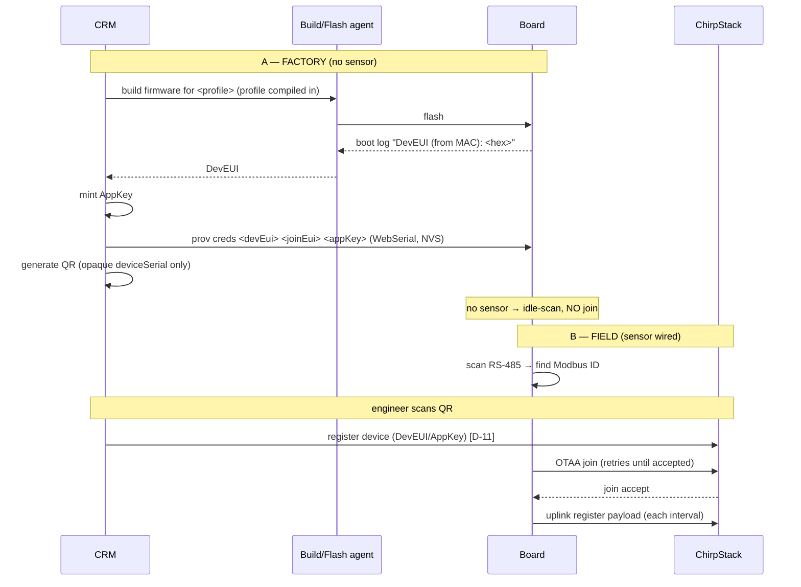

# CRM provisioning workflow — factory → field (authoritative)

> **Audience:** the `crm.siot.solutions` developer + the Claude agent that drives build/flash/provision.
> **Status:** rev2 · 2026-07-01 · QRSEC-01 correction: the QR encodes the opaque `deviceSerial`
> ONLY — never the DevEUI, AppKey, or JoinEUI; aligned to the current firmware (`main`).
> **Supersedes** the sequence in [`CRM_FIRMWARE_AGENT_GUIDE.md`](CRM_FIRMWARE_AGENT_GUIDE.md) (that
> doc's agent prompt/safety-gate mechanics still apply; this doc is the source of truth for the
> **order of operations** and the firmware contract points).
> **Pairs with:** [`PROVISIONING_API_CONTRACT.md`](PROVISIONING_API_CONTRACT.md) (2-plane API),
> [`device-profiles/`](../device-profiles/README.md), ADR-006.

---

## 0. The one-paragraph version

The CRM **builds** a firmware image with the ordered sensor's **device profile compiled in** and
**flashes** it. The board reports a **DevEUI derived from its ESP32-S3 MAC**; the CRM **mints the
AppKey**, writes **DevEUI + AppKey to the board's NVS** (over the WebSerial `prov` console), and
prints a **QR code encoding only the opaque `deviceSerial`** — the DevEUI, AppKey, and JoinEUI are
**never** in the QR. The board, having **no sensor yet**, sits idle — it does
**not** join. In the field, the sensor is wired and the **QR is scanned**, which triggers the CRM to
**look up the stored credentials by serial and register the device in ChirpStack**. The board then
**scans the RS-485 bus for the Modbus ID, joins OTAA, and uplinks** the register payload.

Two independent facts must both be true before a join is accepted: **(B)** creds are in the board's
NVS (factory), and **(A)** the device is registered in ChirpStack (field QR scan).

---

## 1. Sequence

### A — Factory (CRM build + flash, **no sensor**)
1. **Build.** CRM builds the auto-scan / profile-driven firmware with the ordered sensor's **device
   profile compiled in** (see §4 — pending mechanism).
2. **Flash** the board (over the CH340/native-USB port; confirm chip MAC before flashing).
3. **Read DevEUI.** The board logs, early and unconditionally:
   `DevEUI (from MAC): 3cdc75fffe6f85dc`. The CRM reads this back. (The SX1262 has no DevEUI — it is
   derived from the ESP32-S3 MAC; see §3.)
4. **Mint AppKey.** The CRM generates a random 128-bit AppKey. *(The AppKey cannot be read from any
   chip — it originates in the CRM.)*
5. **Write creds → NVS.** The CRM writes `prov creds <devEui> <joinEui> <appKey>` over the WebSerial
   `prov` console (Plane B). JoinEUI is `0000000000000000` for ChirpStack.
6. **Generate QR.** The CRM generates a QR code encoding **only the opaque `deviceSerial`**
   (`DEV-<12hex>`) — the DevEUI, AppKey, and JoinEUI are **never** in the QR. At the field scan, the
   backend resolves the stored credentials from the serial (QRSEC-01).
7. **Idle.** With no sensor, the board scans the bus, finds nothing, and **idles — it does NOT join
   or uplink.** This is the correct factory end state.

### B — Field (install + sensor, **QR scan**)
8. **Install + wire** the sensor to CN1 (A/B + common GND, meter powered, RTU mode).
9. **Discover.** The board scans the bus, finds the sensor's Modbus ID (probes the persisted ID
   first, else a full scan), and **persists** it.
10. **Scan QR → register.** The field engineer scans the QR; the CRM runs auto-provisioning and
    **registers the device in ChirpStack** (Plane A, **D-11**).
11. **Join + uplink.** The board sends OTAA join (creds already in NVS); once ChirpStack has the
    device (step 10), the join is accepted, and the board uplinks the register payload each interval.

---

## 2. Firmware contract points the CRM relies on

These are guaranteed by the current firmware (`main`) — the CRM/agent depends on them:

| # | Contract | Detail |
|---|---|---|
| 1 | **DevEUI-from-MAC boot line** | `DevEUI (from MAC): <16 hex>` logged early, **before any sensor/join** — readable at the factory step with no sensor present. |
| 2 | **`esp> ` provisioning console** | USB-Serial-JTAG, 115200. Commands: `prov creds <devEui16> <joinEui16> <appKey32>`, `prov modbus <baud> <parity> <stopBits> <slaveId>`, `prov show`. (Also `prov-lorawan/-modbus/-profile/-show/-clear/-done`.) All write NVS namespace `prov`. **AppKey is never echoed.** |
| 3 | **Cred priority** | NVS `prov` creds win; else compiled fallback. DevEUI default is MAC-derived; an NVS DevEUI overrides it. |
| 4 | **Idle until provisioned** | With no usable AppKey (empty NVS + placeholder compiled key), the board idles: `AWAITING PROVISIONING`. |
| 5 | **Scan → join → read order** | The field app **scans for the Modbus ID first and idles until a sensor answers** — it does **not** join or uplink without a sensor. Join happens once, **after** discovery. |
| 6 | **Persist + re-scan** | The discovered Modbus ID is persisted (later boots probe it first). If the sensor goes silent for 3 cycles, the board re-scans (session preserved, no re-join). |
| 7 | **Watchdog-safe** | The task watchdog is armed only for the steady-state read loop, never during discovery — a missing/slow bus does not reset-loop the node. |

---

## 3. Identity: DevEUI vs AppKey (important)

- **DevEUI** = derived from the **ESP32-S3 factory MAC** (EUI-48 → EUI-64 with `FF:FE` inserted).
  MAC `3c:dc:75:6f:85:dc` → `3cdc75fffe6f85dc`. Stable, unique-per-board, **from the board** — but
  from the ESP32-S3, **not** the SX1262 (the radio has no DevEUI). The CRM reads it back (contract 1);
  it does **not** assign the DevEUI.
- **AppKey** = a random 128-bit key **the CRM mints**. It **cannot be extracted** from any chip. The
  CRM writes it to NVS (Plane B) **only** — it is **never** put in the QR. The QR encodes only the
  opaque `deviceSerial`; the backend resolves the AppKey (and DevEUI) from the serial at scan time
  (QRSEC-01). **It is a secret** (global §4 / guardrail §3 #4): never log it in plaintext, and never
  transmit it outside the trusted CRM backend / flasher session.

---

## 4. Profile: compiled per-build (pending)

The device profile (register map + payload) is intended to be **compiled into each CRM build** —
only credentials live in NVS. The build service picks the ordered sensor's
`device-profiles/profiles/<id>.json`, generates a C `device_profile_t` from it, and builds. The
firmware's field path is already **source-agnostic** (it reads an "active profile"); today that
profile is loaded from NVS (`prov-profile`, bench path) and the **build-time profile → C generator +
`api/` build-service wiring is the remaining piece.** Until it lands, a CRM build either bakes the
profile in via that generator (target) or provisions it to NVS via `prov-profile` (interim).

---

## 5. ⚠️ Required field-firmware change: join must retry indefinitely

**There is a race in step B:** the board finds the sensor and tries to join, but ChirpStack will not
accept the join until the **QR is scanned + the device is registered** (step 10) — which can be
**minutes** after the board powers on. The current firmware **halts after 5 join attempts (~50 s)**,
so a board powered on before the QR scan would give up and never join.

> **Recommended fix (small, self-contained):** the field firmware should **keep retrying the OTAA
> join indefinitely, with backoff**, instead of halting — so whenever ChirpStack registration
> completes via the QR scan, the **very next join attempt succeeds** with no operator intervention or
> reboot. (Backoff, e.g. 10 s → 30 s → 60 s capped, to respect AS923 fair-use while waiting.)

Until this lands, the CRM/field procedure must ensure the **QR is scanned (device registered) before
the board is powered / within the join-retry window**, or the installer power-cycles the board after
scanning.

---

## 6. The build/flash/provision agent

The mechanics of driving a Claude agent to build → safety-gated flash → provision → verify (the agent
prompt, inputs table, hardware-safety gates, structured result, failure/rollback) are in
[`CRM_FIRMWARE_AGENT_GUIDE.md`](CRM_FIRMWARE_AGENT_GUIDE.md). Align it with this doc on two points:
- **Verify order:** at factory, verification is "boot prints `DevEUI (from MAC)` + `prov show`
  reflects the written creds + board idles (no join)". The join/uplink verification belongs to the
  **field** step (after a sensor + ChirpStack registration), not the factory flash.
- **DevEUI:** read it from the boot log (contract 1); the CRM does not assign it.

---

## 7. Checklist for the CRM developer

- [ ] Build bakes in the ordered sensor's profile (or provisions it via `prov-profile`) — §4.
- [ ] Factory: read `DevEUI (from MAC)`, mint AppKey, `prov creds` → NVS, generate QR.
- [ ] Factory verify: `prov show` shows creds set + board idles (no join, no sensor).
- [ ] Field: QR scan triggers ChirpStack registration (Plane A / D-11).
- [ ] Field firmware retries join indefinitely (§5) — track this firmware change.
- [ ] AppKey treated as a secret end-to-end (§3).

---

## 8. References
- `docs/PROVISIONING_API_CONTRACT.md` — 2-plane provisioning contract (A: ChirpStack, B: NVS).
- `docs/CRM_FIRMWARE_AGENT_GUIDE.md` — the build/flash/provision agent prompt + safety gates.
- `device-profiles/README.md` — profiles (source of truth) + generators.
- `CLAUDE.md` §3 guardrails + §6 hardware safety — the hard rules the agent inherits.
