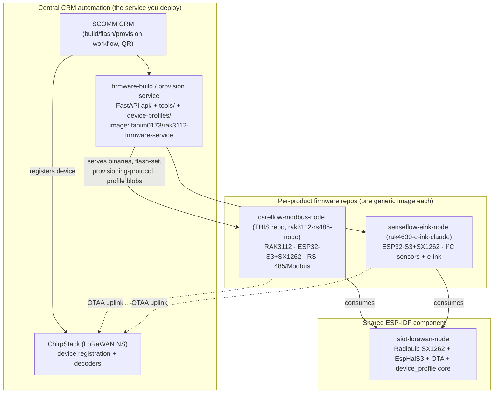
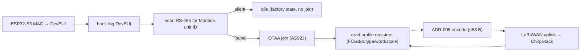

# Careflow / Senseflow LoRaWAN nodes — architecture & CRM/ChirpStack flow (handoff for Fahim)

> **Audience:** Fahim (CRM/ChirpStack + k8s owner) and his Claude Code session.
> **Purpose:** one place that explains the two node products, the firmware-build/provision service you
> deploy, and exactly how a device goes from factory to a joined, decoding device in **production**
> CRM + ChirpStack. Pairs with the deploy runbook [`DEPLOY_KICKOFF.md`](DEPLOY_KICKOFF.md) and the
> authoritative sequence docs [`CRM_PROVISIONING_WORKFLOW.md`](CRM_PROVISIONING_WORKFLOW.md) +
> [`PROVISIONING_API_CONTRACT.md`](PROVISIONING_API_CONTRACT.md).
> **Date:** 2026-07-09.

---

## 1. The big picture (three-layer topology)

Two node **products** share one radio stack and one CRM automation hub. The differentiator is the
**field bus** (RS-485/Modbus vs I²C) — everything else is common.



- **Layer 1 — Central CRM automation (multi-product).** The FastAPI **firmware-build/provision
  service** (`api/`), the profile→blob/decoder/catalog generators (`device-profiles/`), the
  provisioning tooling (`tools/`), and the WebSerial flasher. Lives in **this repo today**; its
  canonical future home is the hub `rnd-southerniot/siot-node-firmware-automation` (cutover deferred —
  see §7). This is what you deploy to k8s.
- **Layer 2 — Shared radio stack** `rnd-southerniot/siot-lorawan-node` (private, `v0.1.0`): the
  RadioLib SX1262 LoRaWAN stack + S3 HAL + OTA + the pure `device_profile` codec. Each node repo pulls
  it via the ESP-IDF component manager (version-pinned) — no copy-paste drift.
- **Layer 3 — Per-node firmware.** `careflow-modbus-node` (this repo) and `senseflow-eink-node`. Each
  ships **one generic binary**; a specific device model is pure **data** (a device profile) provisioned
  into NVS, not a per-device firmware build.

**One design idea to hold onto:** *one image, differentiate by DATA.* The CRM does **not** rebuild
firmware per customer meter — it provisions a device-profile blob into the node's NVS.

---

## 2. Careflow node (RS-485 / Modbus)

**Hardware:** RAK3112-9-SM-I module = **ESP32-S3** (Xtensa LX7, 16 MB flash / 8 MB Octal PSRAM) +
**Semtech SX1262**. Field bus = RS-485 (3PEAK **TP8485E** transceiver) on **UART1** (GPIO43 TX / 44 RX
/ 21 DE-RE), connector CN1 (A/B/GND). LoRaWAN band **AS923** (Bangladesh). Console = native
USB-Serial-JTAG. Onboard WS2812 status LED (GPIO38).

**Firmware (one generic image):**
- **LoRaWAN:** RadioLib + SX1262 via the shared `siot-lorawan-node` component (TCXO 1.8 V, DIO2
  RF-switch). **DevEUI is derived from the ESP32-S3 MAC** (EUI-48 → EUI-64 with `FF:FE`; the SX1262 has
  no EUI) and logged at boot so the CRM can read it back **before** any sensor is attached. NVS DevEUI
  wins if provisioned; **AppKey is CRM-minted** and written to NVS (never compiled/committed).
- **Field app (workflow order):** scan the RS-485 bus for the Modbus **unit ID** → **idle** until a
  sensor answers (no sensor = factory idle, no join) → **join OTAA once** → read the profile's
  registers → ADR-005 encode → **uplink**; re-scan if the sensor goes silent. Join retries indefinitely
  with 10→30→60 s backoff.
- **Profile-driven runtime (ADR-006):** if NVS holds a device-profile blob, a generic reader walks the
  profile's register map (function code, address, type, word order, scale) and encodes the ADR-005
  payload — **zero per-device compiled code**. Otherwise it falls back to a compiled reader.
- **Production hardening (P7):** task watchdog + brownout + reset-cause log (7a); dual-slot **OTA +
  rollback** (7c, `partitions.csv`); **NVS-provisioned creds/config** (7d) — `lora_credentials.h` is a
  last-resort fallback only.
- **NVS layout:** namespace **`prov`** = OTAA creds (u64 deveui/joineui, blob appkey) + Modbus config
  (baud/parity/unit/interval/device); namespace **`profile`** = the device-profile blob; namespace
  **`lorawan`** = DevNonce/session. Provisioning is **additive** (nonces/session survive re-provision).



**Device profiles (`device-profiles/`), the reusable unit:**
- **Source of truth:** `profiles/<model>.json` — bus (baud/parity), defaults (FC/word order), scan
  (how to discover the slave ID), `measurands[]` (register map + scale), ADR-005 `payload[]`, and a
  unique `type_byte`. Everything else is **generated**:
  - `profile_to_blob.py` → the NVS blob (`prov-profile <hex>`), consumed by the firmware.
  - `profile_to_decoder.py` → `chirpstack_fleet_decoder.js` (one JS codec branching on the device byte).
  - `profiles_to_catalog.py` → the top-level catalog the service serves at `GET /v1/sensors`.
- **Unified `type_byte` registry (must stay unique):** `1` Selec MFM384 · `2` RS-FSJT-N01 wind · `3`
  Honeywell EEM400 · `4` Deep Sea (DSE) · **`5` honeywell-eem400-scanned** (new — produced by the Pi
  scanner station, see §4).
- **ADR-005 payload:** 3-byte header `[schema][device_type][flags]` + fixed-point big-endian body,
  ≤ 53 B (AS923 DR3), saturating.

---

## 3. Senseflow node (I²C / e-ink)

**Repo:** `rnd-southerniot/rak4630-e-ink-claude` (`senseflow-eink-node`). Despite the "rak4630" name it
is **ESP32-S3 / ESP-IDF** (a "RAK3312" board) + SX1262. It reuses the **same** shared LoRaWAN stack,
device-profile codec, NVS `prov` schema, and the `esp>` provisioning console — only the **bus** and the
**reader** differ.

- **Field bus:** **I²C** sensors instead of RS-485/Modbus. Compiled sensor drivers → device bytes:
  `bme280 = 0x10`, `sgp40 = 0x11`, `shtc3 = 0x12` (the `0x10+` range keeps it disjoint from careflow's
  `0x01..0x0F` Modbus range). Plus an **e-ink SSD1680** display (`i2c_bus.c` + `sensor_service`).
- **Device profiles v2 (multi-bus):** the profile schema gains a `bus.kind` discriminator
  (`modbus_rtu` for careflow, `i2c` for senseflow). Same NVS blob format / `dp_encode_payload` /
  generators / ChirpStack decoder / `/v1/profile-blob` — only the bus descriptor + read sequence
  differ. So the CRM flow "**select I²C sensor → provision profile blob → flash one generic binary**"
  is identical to careflow's Modbus flow.
- **Status:** OTAA-joined **AS923 on the dev ChirpStack** (device `senseflow-eink-80e4`, DevEUI
  `3cdc75fffe6f80e4`), in the same dev tenant/app as careflow. Consolidating on the single ESP-IDF path
  (the older Arduino `pio/` tree is retired).

**In the service:** senseflow is a **second product** in the registry, sourced as a **pre-built
artifact** (`SENSEFLOW_ROOT` → its `.bin` + boot parts + device-profiles catalog +
`compiled_sensors.json`). It is registered only when `SENSEFLOW_ROOT` is set — **the service is
careflow-only otherwise**. So deploying the service without that env keeps senseflow inert.

---

## 4. The firmware-build / provision service (`api/`) — what you deploy

FastAPI app, **multi-product** (a `?product=` param, default `careflow`; frozen v1 contract). Bearer
auth on every `/v1`+`/v2` route; `/healthz` open. Build artifacts cached in **MinIO** (dual endpoint:
internal ClusterIP for put/stat, external NodePort for browser-reachable presigned GETs). Container
`fahim0173/rak3112-firmware-service`, k8s ns `firmware`, **ClusterIP** (not publicly exposed).

| Endpoint | Purpose |
|---|---|
| `GET /v1/products` | list products (careflow, senseflow-if-configured) |
| `GET /v1/sensors` · `GET /v2/sensors` | the device catalog (v2 = bus-agnostic, for I²C) — **the eem400-scanned profile appears here after deploy** |
| `POST /v1/build` · `GET /v1/builds/{tag}` | (idempotent) firmware build + presigned binary URL + sha256 |
| `GET /v1/flash-manifest` · `GET /v1/flash-part/{name}` | the full **dual-OTA flash set** (bootloader/parttable/nvs-blank/ota-data/app) with offsets + sha256 |
| `GET /v1/provisioning-protocol` | the `esp>` console command set + boot markers the flasher renders its UI from |
| `GET /v1/profile-blob/{key}` | the exact NVS blob hex for `prov-profile <hex>` |

**Product registry** (`api/products.py`): `careflow` (bus `modbus`, firmware **baked into the image**,
profiles re-serialized at request time) and `senseflow` (bus `i2c`, firmware **from the artifact**,
catalog `blobHex` served directly).

---

## 5. Production CRM + ChirpStack flow (factory → field)

A device joins only when **two independent facts** are both true: **(B)** creds are in the board's NVS
(set at the factory), and **(A)** the device is registered in ChirpStack (triggered by the field QR
scan). This is the **two-plane** model (authoritative detail in `CRM_PROVISIONING_WORKFLOW.md` +
`PROVISIONING_API_CONTRACT.md`).

```mermaid
sequenceDiagram
  participant CRM as SCOMM CRM
  participant SVC as firmware-service (api/)
  participant Board
  participant CS as ChirpStack (NS)
  Note over CRM,Board: A — FACTORY (no sensor attached)
  CRM->>SVC: GET flash-manifest + parts (product=careflow)
  SVC-->>CRM: dual-OTA flash set (+sha256)
  CRM->>Board: flash (MAC-confirm gate; erase NVS = clean)
  Board-->>CRM: boot log: DevEUI (from MAC)
  CRM->>CRM: mint AppKey
  CRM->>Board: Plane B — prov creds (DevEUI+AppKey) + prov-profile <blob> over esp> console
  CRM->>Board: prov-done → restart into field mode
  CRM-->>CRM: print QR = opaque deviceSerial ONLY (no DevEUI/AppKey/JoinEUI)
  Note over CRM,Board: Board has creds but NO sensor → idle, does NOT join
  Note over CRM,CS: B — FIELD (sensor wired)
  CRM->>CS: Plane A — on QR scan, look up serial → register device (DevEUI+AppKey) in ChirpStack
  Board->>Board: scan RS-485 for Modbus ID
  Board->>CS: OTAA join (AS923)
  Board->>CS: uplink (ADR-005 payload) → decoded by the fleet codec
```

- **Plane A = ChirpStack registration** — deferred to the **field QR scan** (decision D-11), *not* at
  factory. The QR encodes an **opaque `deviceSerial` only** (QRSEC-01) — DevEUI/AppKey/JoinEUI are
  never in the QR. On scan, the CRM looks up the stored creds by serial and registers the device.
- **Plane B = NVS provisioning** — over the WebSerial **`esp>` console**: `prov creds …` (DevEUI +
  AppKey) and `prov-profile <blob>` (the device profile), then `prov-done`. The console prompt `esp> `
  and the `prov` command names are a **frozen contract** the WebSerial flasher depends on.
- **Decoder:** paste/install `chirpstack_fleet_decoder.js` on the ChirpStack **device-profile** so
  uplinks decode (it branches on the device byte across all profiles — incl. the new eem400-scanned).

### The two stacks (critical operational rule)

| Stack | CRM | ChirpStack | Use |
|---|---|---|---|
| **Developer** | `10.10.8.140` | `10.10.8.140` (AS923, gw `ac1f09fffe1f340d`) | bench / testing |
| **Production** | `crm.siot.solutions` | `chirpstack.siot.solutions` | field / live devices |

- Production is deployed by **Fahim on k8s `10.10.8.168`**; reference repo `rnd-southerniot/
  siot-crm-review` (IDs, API contracts, skills). From Arif's Mac it is **read-only reference**.
- **Rule:** always confirm **dev vs production** before any CRM/ChirpStack action. A device registered
  in the wrong stack won't join; the device **must be in the same tenant as its gateway** (a
  device-limit/cross-tenant mismatch silently blocks the join — a real gotcha we hit).

---

## 6. Where the Pi scanner station fits (what's new this week)

A **Raspberry Pi 5 scanner/profiling station** now sits *upstream* of the CRM flow: plug an **unknown**
RS-485 Modbus device into a Careflow node, and the Pi discovers it (baud/parity/unit + register sweep),
proposes a profile (operator labels it), and **packages a reusable `device-profiles/profiles/<model>.
json`** — which then feeds the exact CRM flow above so the same model onboards instantly next time. It
produced **`honeywell-eem400-scanned` (type_byte 5)**, which is why the service catalog changes with
this deploy. The Pi calls the firmware-service directly at `SCANNER_API_BASE` (`http://10.10.8.169:8000`)
and installs decoders on the **dev** ChirpStack only (a `DEV_GUARD` refuses production).

---

## 7. Tomorrow's deployment (the actual task)

**Recommended: Option A — redeploy this repo's `api/` to your k8s.** Small, reversible, ships the new
scanner profile + P7 hardening. **Do not** also start the hub (`siot-node-firmware-automation`) cutover
in the same sitting — that changes how the firmware image is built and must be **hardware-verified**
first. (Arif's and both Claude sessions' recommendation.)

**Steps (full runbook in [`DEPLOY_KICKOFF.md`](DEPLOY_KICKOFF.md)):**
1. `git pull` main; note HEAD (`1046f5e` after PR #18).
2. Compare the **currently-deployed image git-sha** (`kubectl -n firmware get deploy -o wide`) against
   main — this is a **big version jump** (old → P5–P7 + scanner), not a patch.
3. Build + push the image **pinned to the git sha** (no `:latest`).
4. `kubectl apply` / rollout; watch readiness.
5. **Verify:** `/healthz` ok → `GET /v1/products` → `GET /v1/sensors` **lists `honeywell-eem400-scanned`**
   → `GET /v1/flash-manifest` + `/v1/provisioning-protocol` respond.
6. **Network reachability:** confirm the bench Pi can reach the service at `http://10.10.8.169:8000`
   (container-healthy ≠ deploy-done — the Pi scanner is a new direct consumer).

**Rollback:** re-apply the previous image sha (that's why we pin, not `:latest`).

### Guardrails (hard)
- **Two ChirpStack stacks** — prompt **dev vs production** before any CRM/ChirpStack action; production
  is read-only unless Arif authorizes a specific write.
- No secrets in the repo (creds via k8s secrets / gitignored `.env`); gitleaks gates CI.
- **No `:latest`** image tags; small reversible steps; documented rollback per change.
- Green CI is the merge gate to `main` (PR flow enforced).

---

## 8. Reference map + current state

**Authoritative docs (read these for depth):**
- `docs/CRM_PROVISIONING_WORKFLOW.md` — factory→field order of operations (source of truth).
- `docs/PROVISIONING_API_CONTRACT.md` — the 2-plane API contract.
- `docs/CRM_FIRMWARE_AGENT_GUIDE.md` — how the CRM drives a Claude agent (safety-gated flash, confirm MAC).
- `device-profiles/README.md` — profile → blob/decoder/catalog generation.
- `pi-scanner/README.md` + `pi-scanner/deploy/` — the scanner station + its Pi kiosk.
- `DEPLOY_KICKOFF.md` — the deploy kickoff prompt/runbook.

**Repos:** `rak3112-rs485-node` (careflow + the hub source) · `siot-lorawan-node` (shared stack) ·
`rak4630-e-ink-claude` (senseflow) · `siot-node-firmware-automation` (future hub) · `siot-crm-review`
(production reference).

**Bench state (2026-07-09):** merged to `main`: PR #16 (Pi scanner station), #17 (eem400-scanned
profile), #18 (kiosk). Bench Pi `192.168.68.109` runs the scanner kiosk. Scanner node
`3c:dc:75:6f:7d:c4` + EEM400 slave-sim `3c:dc:75:6f:81:78` on the bench. No open PRs.
