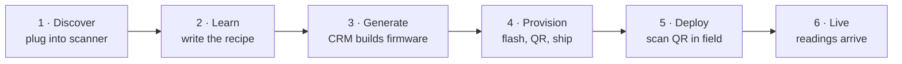
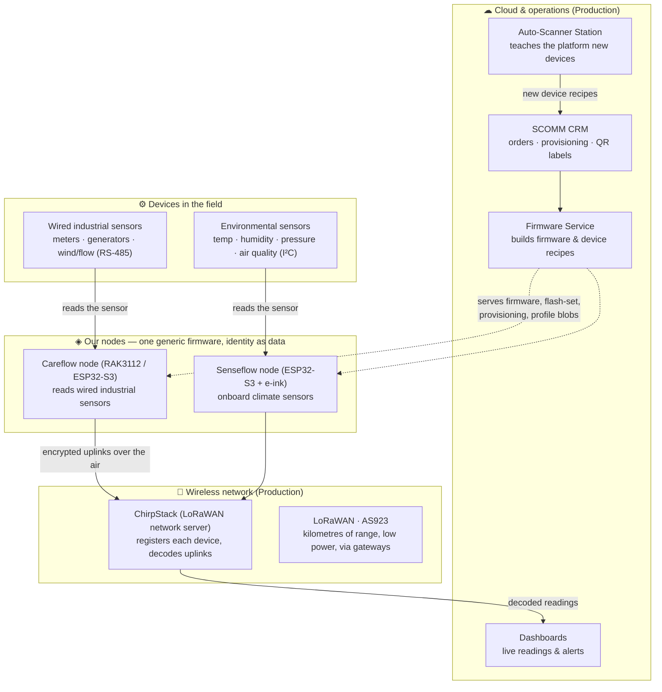

# Southern IoT — Device Platform Overview

> **From an unknown wire to a live wireless product — automatically.**
>
> Plain-language walkthrough of the whole platform: scan an unknown industrial sensor → auto-generate a
> reusable device profile → build firmware + provision the device → stream its readings over long-range
> wireless to the cloud. Written for a non-technical audience (sales, marketing, leadership), with the
> underlying tech named in parentheses for engineers.
>
> **Companion docs:** [`FAHIM_HANDOFF.md`](FAHIM_HANDOFF.md) (architecture + CRM/ChirpStack flow, deep),
> [`DEPLOY_KICKOFF.md`](DEPLOY_KICKOFF.md) (deploy runbook), `device-profiles/README.md` (profile →
> blob/decoder/catalog). Interactive version:
> `https://claude.ai/code/artifact/706a5d98-9871-44e4-96d4-03d94ac93dcd`.
> Date: 2026-07-09.

---

## The one-line pitch

Plug any industrial sensor into our scanner and the platform teaches itself to read it, builds the
firmware, provisions the device, and streams its readings to the cloud over long-range wireless — with
**no manuals and no custom engineering per customer**.

**Value at a glance:**

| | |
|---|---|
| **2** | product lines, one shared platform |
| **1** | firmware image fits every device |
| **Minutes** | to onboard a brand-new device model |
| **0** | lines of custom code per customer |

---

## How a device becomes a product — the 6-step journey

One device, from the moment it's connected to the moment its readings appear on a dashboard.

**Step 1 — Discover.** A technician connects an unknown industrial sensor — an energy meter, a
generator controller, a wind gauge — to the **Auto-Scanner Station**. No manuals and no engineer: the
station listens on the wire and works out how to talk to it on its own.
*Behind the scenes:* scans the RS-485/Modbus bus, finds the device (e.g. `9600 8N1`), maps its registers
(voltage, power, energy).

**Step 2 — Learn.** The station turns what it discovered into a **reusable device recipe** ("device
profile") and files it in the shared device library. Next time this model appears — for any customer —
the platform already knows it, instantly.
*Behind the scenes:* emits `device-profiles/profiles/<model>.json` (source of truth) → regenerates the
NVS blob, ChirpStack decoder, and service catalog.

**Step 3 — Generate.** For a customer order the **CRM** picks the product line, generates the firmware,
and mints secure wireless credentials — automatically. One firmware fits every device; the specific
sensor is simply data placed on top.
*Behind the scenes:* firmware-build/provision service builds the binary, mints the LoRaWAN AppKey,
attaches the profile blob, prints a QR label.

**Step 4 — Provision.** The node is programmed and loaded with its identity and the device recipe, then
labelled with a QR code and shipped. Nothing secret is printed on the box — only an anonymous serial
number.
*Behind the scenes:* flash the generic image; load credentials + profile into NVS over the `esp>`
console; the QR encodes the device serial only (no DevEUI/AppKey/JoinEUI).

**Step 5 — Deploy.** The installer wires the sensor and scans the QR code. That single scan tells the
network to expect this device. The node powers up, recognises the sensor, and gets ready to report.
*Behind the scenes:* QR scan → CRM registers the device (DevEUI + AppKey) in ChirpStack; the node scans
the bus for the sensor's Modbus ID.

**Step 6 — Live.** The node joins the long-range wireless network and starts sending readings —
kilometres away, on a tiny power budget. ChirpStack decodes them and the numbers land on the dashboard
in real time.
*Behind the scenes:* OTAA join on AS923; compact ADR-005 uplink decoded by the fleet codec → dashboard.

---

## The platform map — one system, sensor to cloud

Readings flow **upward**: from the device in the field, through our node, over the air, into the cloud.
The **Auto-Scanner Station** sits on top, teaching the platform every new device it meets.

- **Cloud & operations** — the CRM, the firmware-build/provision service, and dashboards. The scanner
  feeds new device recipes into the library here. (Production stack.)
- **Wireless network** — ChirpStack (the LoRaWAN network server) registers each device and decodes its
  uplinks; LoRaWAN AS923 carries the data kilometres on a tiny power budget via field gateways.
- **Our nodes** — one generic firmware per product; a specific device model is pure **data** (a profile
  blob provisioned into NVS), not a per-device firmware build.
- **Devices in the field** — what the customer already owns or installs: wired industrial sensors
  (Careflow) or environmental sensors (Senseflow).

---

## Two products, one platform — same brains, different senses

Both products share the **exact same** wireless stack, cloud, onboarding flow, and provisioning console.
The only difference is what they connect to in the field.

### Careflow · Industrial (wired sensing)

Reads existing industrial equipment over its data wire and puts it online.

- **Reads** — energy meters, generator controllers, wind & flow sensors over **RS-485 / Modbus**.
- **Ideal for** — factories, utilities, generators, remote industrial sites.
- **Hardware** — RAK3112 module (**ESP32-S3 + long-range SX1262 radio**).
- **Real devices onboarded** — Selec MFM384 energy meter · Honeywell EEM400 · Deep Sea (DSE) generator
  controller · RS-FSJT-N01 wind sensor. (Device bytes `0x01–0x0F`.)

### Senseflow · Environmental (onboard sensing)

Self-contained climate & air monitor with a built-in display — install and go.

- **Measures** — temperature, humidity, pressure & air quality from **built-in I²C sensors**.
- **Ideal for** — buildings, cold chain, warehouses, agriculture, offices.
- **Hardware** — ESP32-S3 + long-range SX1262 radio + **e-ink display**.
- **Real sensors** — BME280 climate · SGP40 air quality · SHTC3. (Device bytes `0x10+`.)

**Shared by both:** long-range wireless (LoRaWAN AS923) · Production CRM · ChirpStack network · one
firmware image · QR provisioning.

---

## Why it scales — one firmware, any device, configured by data not code

Every node ships with the same, fully-tested firmware. A specific meter or sensor is described as a
small "recipe" — created once by the scanner and loaded onto the device as data. That's how a brand-new
device model goes from unknown to shipping in minutes.

1. **No engineer per device.** The scanner writes the recipe automatically — no firmware developer in
   the loop.
2. **One image to maintain.** Fix or improve once, and every product in the field benefits. Lower risk,
   faster releases.
3. **Instant catalogue growth.** Each device onboarded becomes reusable across every future customer,
   forever.

---

*This is the plain-language overview. For the two-plane factory→field provisioning sequence, the
firmware-service API contract, and the CRM/ChirpStack details, see
[`FAHIM_HANDOFF.md`](FAHIM_HANDOFF.md).*
