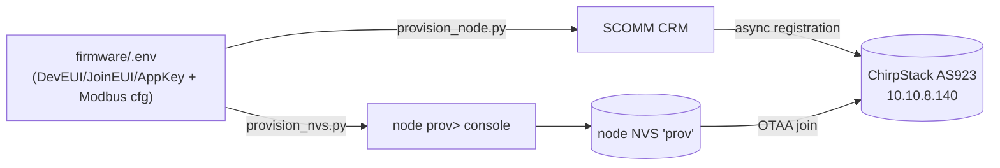

# Provisioning API Contract — CRM → ChirpStack auto-provisioning

> **Status:** rev1 · 2026-06-28 · derived from `tools/provision_node.py` (CRM workflow plane) and
> `tools/provision_nvs.py` + `firmware/main/provisioning.c` (device NVS plane).
> **Scope:** documents the API contract, value sources, and a fill-in template for provisioning a
> `rak3112-rs485-node` end-to-end. The **system of record is the SCOMM CRM** (`siot-crm-review`),
> which is what registers the device into ChirpStack — the firmware never talks to ChirpStack's
> gRPC/REST API directly.

---

## 1. Two provisioning planes

A node is "provisioned" only when **both** planes are satisfied. They are independent and can run in
either order; neither writes the other's store.

| Plane | Driver | Talks to | Writes | Purpose |
|---|---|---|---|---|
| **A — Network / identity** | `tools/provision_node.py` | SCOMM CRM REST API → (async) ChirpStack | ChirpStack device registry (AS923 app + device profile) | Register DevEUI/AppKey so the node's OTAA join is accepted by the network server |
| **B — Device / runtime** | `tools/provision_nvs.py` → `provisioning.c` console | Node USB-Serial-JTAG console | Node NVS namespace `prov` | Put the same DevEUI/JoinEUI/AppKey **and** Modbus field config onto the device, replacing compiled-in secrets |

Both planes consume the **same secret source**: `firmware/.env` (gitignored). That single file is
the join point that guarantees the credentials registered in ChirpStack (Plane A) match the
credentials the device joins with (Plane B).



---

## 2. Source-of-values matrix

Every value pushed during provisioning, and exactly where it comes from. **No value is invented at
call time** — each has a single authoritative source.

| Value | Used in | Source | Notes |
|---|---|---|---|
| `LORAWAN_DEVEUI` | both planes | `firmware/.env` | 16 hex, lowercased before use. Per-device unique. CRM/operator minted. |
| `LORAWAN_JOINEUI` | Plane B (NVS) | `firmware/.env` (default `0000000000000000`) | 16 hex. Not submitted in Plane A (CRM derives app/JoinEUI server-side). |
| `LORAWAN_APPKEY` | both planes | `firmware/.env` | 32 hex. **SECRET** — redacted in all logs, never printed/committed. |
| `serial` | Plane A | **derived**: `"RAK3112-RS485-" + DevEUI[-6:].upper()` | Human-readable device serial. |
| `CRM_BASE` / `CRM_EMAIL` / `CRM_PASSWORD` | Plane A | env, sourced from `~/.config/siot/rak3112-crm.env` (0600, outside repo) | CRM login. Never committed. |
| `PRODUCT_CODE` | Plane A | constant `RAK3112-RS485-AS923` | Find-or-create key for the CRM product. |
| `PRODUCT_NAME` | Plane A | constant | Display name on create. |
| `lorawanRegion` | Plane A | constant `AS923` | Must match ChirpStack region (OQ-4 / ADR-004). |
| `HARDWARE_NAME` | Plane A | constant `ESP32-WROOM-32` | Reuses a valid catalog entry; true identity carried in serial/DevEUI. |
| `clientName/Email/Phone/Address`, `contactPerson` | Plane A | constants (bench values) | Onboarding task metadata; replace per real install. |
| `scheduledDate`, `reportData`, `hardwareList` | Plane A | constants (bench values) | Workflow-step payloads; bench placeholders. |
| `firmwareVersion` | Plane A | constant (e.g. `phase5-bringup`) | Recorded against the device in CRM. |
| `MODBUS_DEVICE` | Plane B | `firmware/.env` | `mfm384`→`dev=0`, `rsfsjt`/`wind`/`1`→`dev=1`. |
| `MODBUS_BAUD` | Plane B | `firmware/.env` | MFM384=9600, RS-FSJT=4800. |
| `MODBUS_PARITY` | Plane B | `firmware/.env` | `N`→0, `E`→1, `O`→2. |
| `MODBUS_SLAVE_ID` | Plane B | `firmware/.env` | Modbus unit id. |
| `SAMPLE_INTERVAL_S` | Plane B | `firmware/.env` (default 60, min 10) | Sample + uplink period. |

---

## 3. Plane A — CRM onboarding workflow API contract

Base URL: `$CRM_BASE`. Auth: `Authorization: Bearer <access_token>` (from login). All bodies JSON.
The workflow is a **state machine**; ChirpStack registration is triggered as an async side-effect of
the `READY_FOR_INSTALLATION` transition.

### 3.1 Endpoints (in call order)

| # | Method | Path | Body (key fields) | Returns | Purpose |
|---|---|---|---|---|---|
| 1 | `POST` | `/auth/login` | `{email, password}` | `{access_token, user{role{name}}}` | Authenticate |
| 2 | `GET` | `/products` | — | `[{id, code, ...}]` | Find product by `code` |
| 2 | `POST` | `/products` | `{name, code, description, isLorawanProduct, lorawanRegion}` | `{id}` | Create if absent |
| 2b | `GET` | `/products/{id}/sop-template` | — | `{id}` or 4xx | Check SOP exists |
| 2b | `POST` | `/products/{id}/sop-template` | `{productId, version, steps[]{id,title,description,order}}` | `{id}` | Create SOP (prereq for tasks) |
| 3 | `GET` | `/hardware-catalog` | — | `[{id, name}]` | Resolve `hardwareId` by `name` |
| 4 | `POST` | `/workflow/tasks` | `{clientName, clientEmail, clientPhone, clientAddress, contactPerson, productId}` | `{id, currentStatus}` | Create onboarding task |
| 5 | `PUT` | `/workflow/tasks/{id}/status/{STATUS}` | per-status body (see 3.2) | `{currentStatus}` | Advance state machine |
| 6 | `PUT` | `/workflow/tasks/{id}/pre-installation-checklist` | 9 boolean flags (see 3.3) | 2xx | Complete checklist |
| 7 | `PUT` | `/workflow/tasks/{id}/status/READY_FOR_INSTALLATION` | `{}` **(empty)** | `{currentStatus}` | Trigger async ChirpStack registration |
| 8 | `GET` | `/workflow/tasks/{id}` | — | `{deviceProvisionings[]{devEui, lorawanProvisioningStatus, lorawanProvisioningError}}` | Poll provisioning result |
| 9 | `GET` | `/chirpstack/device/{deveui}` | — | `{found, device{name, applicationId, deviceProfileId}}` | Verify in ChirpStack |

### 3.2 Workflow state transitions (`PUT .../status/{STATUS}`)

Ordered. Each must return `currentStatus == {STATUS}` or the run aborts.

| Order | STATUS | Body |
|---|---|---|
| 1 | `SCHEDULED_VISIT` | `{"scheduledDate": "<ISO-8601>"}` |
| 2 | `REQUIREMENTS_COMPLETE` | `{"reportData": {siteConditions, signalStrength, powerAvailability, installationLocation, notes}}` |
| 3 | `HARDWARE_PROCUREMENT_COMPLETE` | `{"hardwareList": [{hardwareId, quantity, notes}]}` |
| 4 | `HARDWARE_PREPARED_COMPLETE` | `{"deviceList": [{hardwareId, deviceSerial, firmwareVersion, devEui, appKey, notes}]}` ← **DevEUI + AppKey submitted here** |
| 5 | `READY_FOR_INSTALLATION` | `{}` ← **MUST be empty** (DTO whitelist 400s on any extra field, incl. lat/long) |

### 3.3 Pre-installation checklist body (all `true`)

```json
{
  "devicesTestComplete": true, "firmwareLoaded": true, "qrCodesPrinted": true,
  "clientConfirmedDate": true, "accessArranged": true, "contactAvailable": true,
  "installationGuide": true, "networkConfig": true, "credentialsReady": true
}
```

### 3.4 Provisioning status (polled at step 8)

`lorawanProvisioningStatus` ∈ `{PENDING, IN_PROGRESS, COMPLETED, FAILED}`. Poll `GET /workflow/tasks/{id}`
every 2 s up to ~24 s; on `FAILED`, `lorawanProvisioningError` carries the reason. Final truth is
`GET /chirpstack/device/{deveui}` → `found: true`.

### 3.5 Contract gotchas (load-bearing)

- **`READY_FOR_INSTALLATION` takes an empty body.** The status DTO whitelist rejects any extra field
  (e.g. `latitude`/`longitude`) with `400 ValidationError`.
- **SOP template is a hard prerequisite** for `POST /workflow/tasks`; `productId` goes in the **body**,
  and each step needs `id/title/description/order` (`CreateSOPTemplateDto`).
- **AppKey is write-only** in this flow — submitted at `HARDWARE_PREPARED_COMPLETE`, never read back.
- Registration is **async** — the `READY_FOR_INSTALLATION` 200 does not mean ChirpStack is done; poll.

---

## 4. Plane B — device NVS console contract (`prov>`)

Transport: USB-Serial-JTAG REPL on the node (only reachable when unprovisioned, or via the
field-mode console). Namespace `prov`. Writes are **additive** — the `lorawan` nonce/session namespace
is preserved (no DevNonce regression on re-join).

| Command | Args | NVS keys written | Types |
|---|---|---|---|
| `prov-lorawan` | `<deveui16> <joineui16> <appkey32>` | `deveui`, `joineui`, `appkey` | `u64`, `u64`, `blob[16]` |
| `prov-modbus` | `<dev 0\|1> <baud> <par 0\|1\|2> <unit> <interval_s>` | `dev`, `baud`, `par`, `unit`, `intv` | `u8`, `u32`, `u8`, `u8`, `u32` |
| `prov-show` | — | (reads) | appkey shown as `set/unset` only |
| `prov-clear` | — | erases `prov` namespace | — |
| `prov-done` | — | commit + `esp_restart()` into field mode | — |

Responses are line-oriented: `OK ...` on success, `ERR ...` on failure. The host driver
(`provision_nvs.py`) treats absence of `OK` as fatal.

---

## 5. Operation

```bash
# Plane A — register in ChirpStack via CRM
source ~/.config/siot/rak3112-crm.env      # CRM_BASE / CRM_EMAIL / CRM_PASSWORD
python3 tools/provision_node.py            # reads firmware/.env, exits 0 iff ChirpStack found

# Plane B — load creds + field config onto the device
. ~/esp/esp-idf-v5.5.4/export.sh           # for pyserial
python3 tools/provision_nvs.py -p /dev/cu.usbmodem1301
```

Exit codes — `provision_node.py`: `0` = device found in ChirpStack, `2` = not found.

---

## 6. Fill-in template

The canonical per-node value template lives at [`tools/provision_template.json`](../tools/provision_template.json).
It is the declarative source-of-values descriptor: secrets stay as `${ENV:...}` references (resolved
from `firmware/.env` / `~/.config/siot/...` at run time), never inlined.
